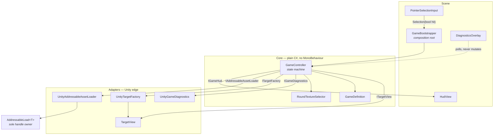
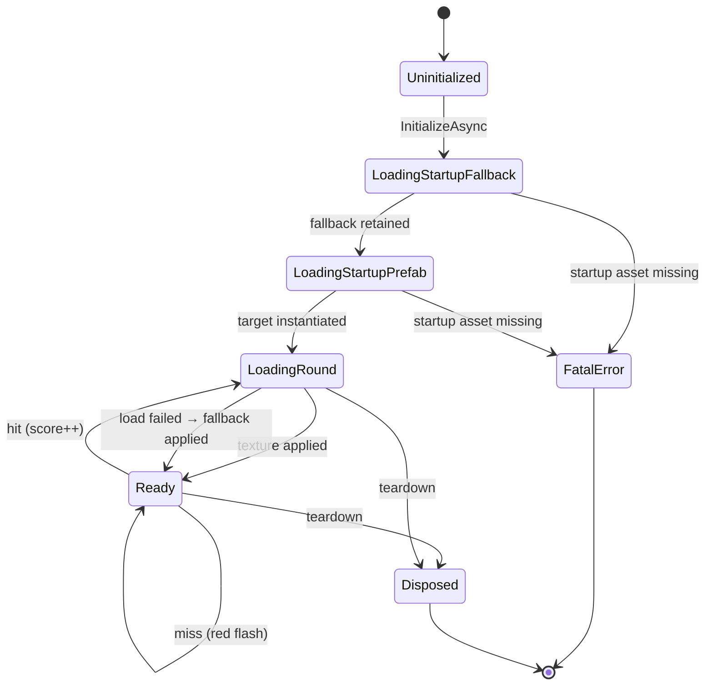
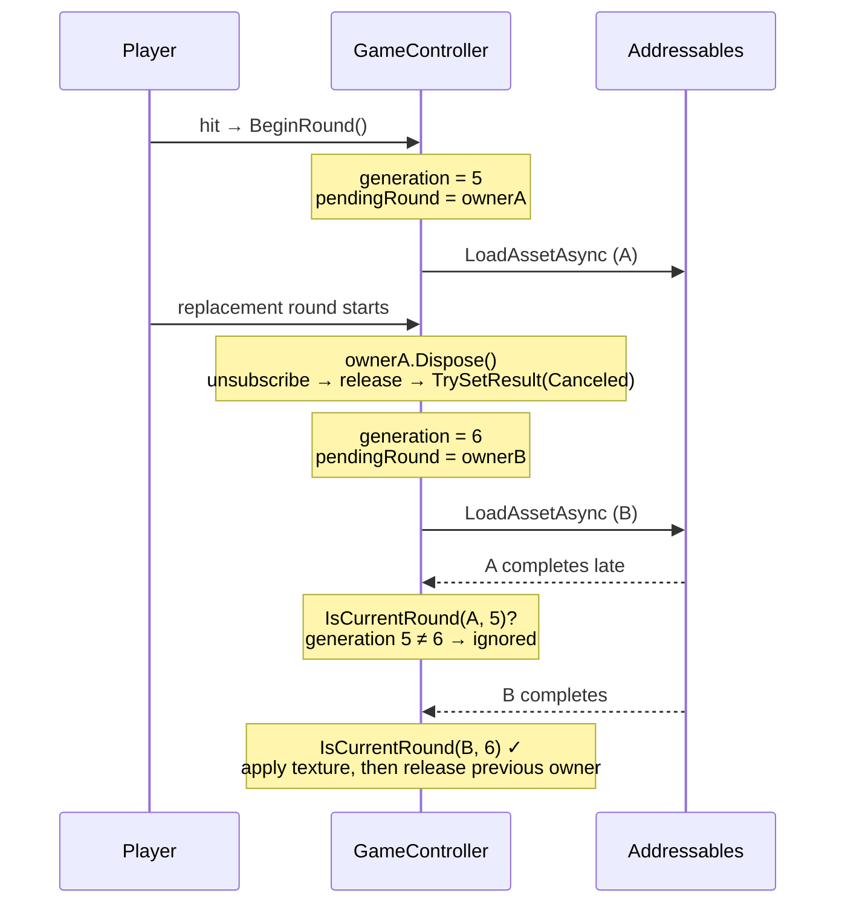

# Addressables Selection Demo

[](https://github.com/Yurii-Tor/Addressables-Sample/actions/workflows/tests.yml)
[](https://github.com/Yurii-Tor/Addressables-Sample/actions/workflows/webgl-demo.yml)
[](LICENSE)
[](https://unity.com)

A one-scene Unity game about a single tappable cube — and a study of how to own
`AsyncOperationHandle` correctly.

Tap the cube: the score goes up and the next image is requested through Addressables.
Miss it: the cube flashes red and nothing else moves. If a request fails, a retained
fallback texture takes over and the game stays playable. The interesting part is
everything that has to be true for those three sentences to hold under async load,
cancellation, and teardown.

**▶ [Play it in your browser](https://demos.torproduction.com/addressables-selection/)**

<!--
  Record Docs/media/demo.gif and add it here:

  

  Suggested capture: 800x450, ~10 seconds, covering startup, a hit with the score
  increment, the "Loading image..." state, the new texture arriving, and one deliberate
  miss with the red flash. Keep the diagnostics overlay visible -- it is the point.
-->

---

## What this actually demonstrates

| Concern | How it is solved here |
|---|---|
| **Handle ownership** | `AddressableLoad<T>` is the only production type that touches `Addressables.Release`. One instance owns exactly one acquired reference and releases it exactly once. An `EditMode` test greps the runtime source to keep it that way. |
| **Cancellation** | Addressables cannot abort a transport. Cancellation here means *logical invalidation*: every round carries a generation number and an owner identity, and every continuation re-checks state, generation, owner, and target validity before it may mutate anything. A stale completion is provably unable to overwrite a newer texture. |
| **No synchronous waiting** | No `WaitForCompletion`, no `Task.Wait`, no blocking `.Result`. Enforced by `SourceAuditTests`, not just by convention. |
| **Testable game logic** | `GameController` is a plain C# state machine with zero Unity dependencies beyond `Texture2D`/`GameObject`. Every failure path — factory failure, texture-apply failure, fallback-apply failure, dispose mid-flight — has a test. |
| **No material instancing** | Round textures are applied through a `MaterialPropertyBlock`. The shared material is never cloned. |
| **Deterministic project generation** | The scene, prefab, upright-UV mesh, material, fallback texture, post-processing profile, and Addressables groups are all generated by idempotent Editor tooling and asserted by a structural validator that runs in CI. |
| **Real remote delivery** | Round-texture bundles use **Pack Separately**, so every round is its own request. The desktop build fetches them over HTTPS from Cloudflare; the browser demo ships them inside the player, because Addressables content is platform specific and a WebGL player cannot load desktop bundles. |

Press <kbd>~</kbd> or <kbd>F1</kbd> in play mode to toggle the diagnostics overlay. It shows
the live controller state, the round generation counter, the number of live Addressables
handle owners, and the duration of each settled round — the things this project is really
about, made visible.

---

## Architecture

`GameBootstrapper` is the only `MonoBehaviour` that knows how the pieces fit together. It
constructs the controller with concrete Unity adapters and disposes it on destroy.



The controller depends only on `IGameConfiguration`, `IAddressableAssetLoader`, `IGameHud`,
`ITargetFactory`, and `IGameDiagnostics`. That is why the EditMode suite can drive every
branch with fakes and still be meaningful.

### Controller state machine



Player input is accepted **only** in `Ready`. Startup and round loading disable the
collider, so a tap during a load cannot start a competing request through normal play.

### Why a late completion cannot win



Four ownership facts hold at every point: startup owners live until teardown; the displayed
round owner is released only *after* its replacement has been applied; a disposed owner
never releases twice; and teardown destroys the target instance before releasing the prefab.

---

## Quick start

1. Install Unity **6000.3.21f1** and clone the repository. No Git LFS is required — every
   asset is stored directly in Git.
2. Open the project and let Unity resolve the locked packages.
3. Open `Assets/_Project/Scenes/Game.unity` and press Play.

The default Addressables workflow is **Use Asset Database (fastest)** with a `0.25` s
simulated load delay, so loading is observable without building content or running a server.

If the generated content ever looks wrong, run **AddressablesSample > Game > Setup Test Task** — it
rebuilds the scene, prefab, material, fallback texture, post-processing profile, and
Addressables configuration idempotently, then **AddressablesSample > Game > Validate Generated
Project** to assert the result.

---

## Tests

```powershell
$unityPath = 'C:\Program Files\Unity\Hub\Editor\6000.3.21f1\Editor\Unity.exe'
& $unityPath -batchmode -nographics -projectPath (Get-Location).Path `
  -runTests -testPlatform EditMode -testResults Logs/EditMode.xml -logFile Logs/EditMode.log
```

Swap `EditMode` for `PlayMode` to run the play-mode suite. Both suites run on every push
through [`.github/workflows/tests.yml`](.github/workflows/tests.yml).

What the suites cover:

- **EditMode** — controller lifecycle and every failure branch, owner release ordering,
  stale-completion rejection across three out-of-order requests, config validation,
  round-robin selection, a source audit for forbidden synchronous waits, and the structural
  project validator.
- **PlayMode** — real Input System mouse and touchscreen devices against the real generated
  scene, a real Addressables round failure that falls back and stays playable, and teardown
  during an in-flight load.

The deliberate invalid-round test asserts its single expected warning; any *other*
unexpected Unity error fails the run.

---

## Addressables workflows

| Menu command | Purpose |
|---|---|
| **Use Asset Database** | Default local development. No content build, no server. |
| **Build Local + Use Existing Build** | Real bundles and catalog, loaded from the local build path. |
| **Build Cloudflare Remote + Use Existing Build** | Real bundles written to `ServerData/[BuildTarget]` for HTTPS hosting. |
| **Use Uploaded Cloudflare Build** | Re-activate already-built, already-published remote content. |
| **Clear Download Cache** | Drop cached remote bundles before a fallback probe. |
| **Restore Local Defaults** | Return to the offline baseline. |

Full operational detail — batch-mode commands for every workflow, the Cloudflare build and
publish sequence, how to provoke a real HTTP 404 and observe the fallback, and the known
limitations — lives in **[Docs/Operations.md](Docs/Operations.md)**.

---

## Project layout

```
Assets/_Project/
  Runtime/
    Core/            GameController, contracts, state, definition, selector  — plain C#
    Addressables/    UnityAddressableAssetLoader + AddressableLoad<T> (sole handle owner)
    Presentation/    Bootstrapper, HUD, input, target view, diagnostics overlay
    Config/          GameConfig ScriptableObject (AssetReference wiring)
  Editor/            Idempotent generation, structural validation, workflows, CI entry points
  Tests/
    EditMode/        Controller, ownership, config, source audit, structural validation
    PlayMode/        Real scene, real input devices, real Addressables
Docs/
  Requirements.md    Traceable requirement list derived from the source PDF
  Operations.md      Build, deploy, and validation procedures
```

Everything under `Assets/_Project/Scenes`, `Prefabs`, `Meshes`, `Materials`, `Textures`, and
`Rendering` is **generated** by `TestTaskSetup` and reconciled in place, so re-running setup
never duplicates objects or churns GUIDs.

---

## Requirements traceability

The original brief is preserved in `Docs/TestTask.pdf`. `Docs/Requirements.md` normalizes it
into numbered requirements (`REQ-F01`…`REQ-OPT01`) with acceptance criteria, and the
Definition of Done at the end of that file maps one-to-one onto the test suites above.

---

## How this was built

This project was implemented with an AI coding agent under an explicit set of architectural
constraints that I authored and enforced — see [`AGENTS.md`](AGENTS.md) for the working
agreement and [`Docs/ImplementationPlan.md`](Docs/ImplementationPlan.md) for the
decision log.

My contribution is the part that determines whether the result is any good: the requirement
normalization, the ownership and cancellation model, the "one owner per handle" rule, the
decision to keep the controller free of Unity types, the ban on third-party async libraries,
and the acceptance criteria that every branch is tested against. The agent wrote code inside
those boundaries; the boundaries are the engineering.

I am happy to walk through any decision in it.

---

## License and attribution

Code and generated content: [MIT](LICENSE).

The ten animal PNGs in `Assets/Textures` were supplied with the original test task and are
**not** covered by that license — see [`Docs/ThirdPartyNotices.md`](Docs/ThirdPartyNotices.md)
before reusing them.
